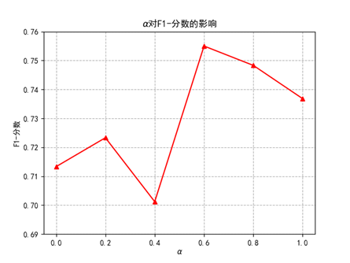
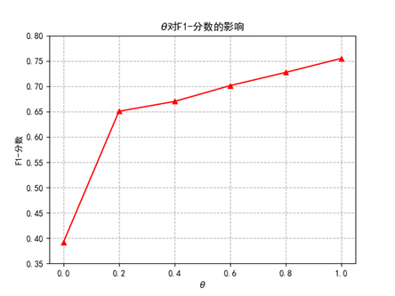

# Multimodal_Generative_Adversarial_Networks_Based_Multivariate_Time_Series_Anomaly_Detection

##Introduction
We propose a Multimodal Generative Adversarial Networks Based Multivariate Time Series Anomaly Detection (MGAN:MTSAD) strategy to address the problem of the existing unimodal learning anomaly detection models for time series data and the needs of multivariate anomaly detection for time series data. Experimental results on multiple datasets show that compared with the baseline model,the proposed method improves the F1-score metrics.The proposed method can identify multivariate time series data anomalies well,with good robustness and generalizability.

本文提出一种通用的多模态编码器-多模态生成器-判别器框架，引入一种特征矩阵构造
方式来获取时序数据的变量间的信息，通过编码器及生成器挖掘数据的时序特征分布，实现
时序数据异常的有效检测。  
  
本文也提出一种基于GAN的多元时间序列数据异常检测方法，实验证明，该方法可以很好地
拟合时空中的非线性关系，从而实现时序信息的异常检测。

##Requirements
python 3.8
pytorch 1.7.8 + cuda 10.2

##Usage
###Data Preparation
We apply our method on the SWaT and WADI datasets in the paper, however, we didn't upload the data in this repository because some copyright reasons. Please refer to https://itrust.sutd.edu.sg/ and send request to iTrust is you want to try the data.  
因为版权原因，SWAT、WADI等数据集请读者自行去官网申请下载。
###Training and testing
You will need to specify the network and dataset you want to train and test by manually put data into the relevant folder.  
请把数据集放入相应的文件夹进行训练，我们建议的参数设置为下：

###train
- dataset = SWAT、KDDCUP99、WADI、CICIDS
- gpu_id = 0
- alpha = 0.8
- epochs = 200
- optimizer: Adam
- lr_init = 1e-5
- betas=(0.9, 0.999)
- batch_size = 64

##Result
Results obtained on three datasets when experiments are performed using alpha = (0, 0.2, 0.4, 0.6, 0.8, 1.0)  
在这里仅展示超参数alpha、theta的消融实验结果，详细实验结果请详细阅读论文。

- alpha = 0.2(prune FP)  
theta = 1 : f1-score = 0.7233  
theta = 0.8 : f1-score = 0.7159  
theta = 0.6 : f1-score = 0.6888  
theta = 0.4 : f1-score = 0.6667  
theta = 0.2 : f1-score = 0.6437  
theta = 0 : f1-score = 0.3477  
- alpha = 0.6 and lambda_ = 0.5  
theta = 1 : f1-score = 0.7550  
theta = 0.8 : f1-score = 0.7273  
theta = 0.6 : f1-score = 0.7012  
theta = 0.4 : f1-score = 0.6699  
theta = 0.2 : f1-score = 0.6504  
theta = 0 : f1-score = 0.3912
  
